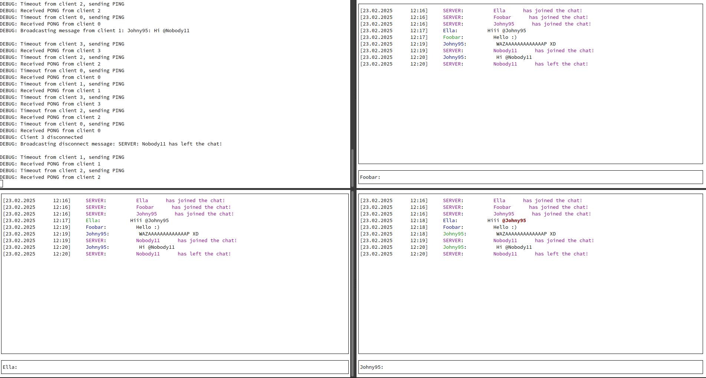

# **TermTalk: A Terminal-Based Chat Application in Rust**

**Version: 0.3**

This repository contains a simple **terminal-based chat application** built in Rust, leveraging asynchronous programming and multithreading for real-time communication. The application consists of a **server** and a **client**, allowing multiple users to connect and chat in a shared terminal environment. You can run several separate terminal clients and emulate users talking. Created and tested on Fedora 40. The development is still ongoing and will continue for the time being. This is a hobby project of mine and a proof of concept rather than a proper application.

---

## **Screenshot**

Here is a screenshot of TermTalk in action (terminal used in the picture: [Terminator](https://gnome-terminator.org/)):



---

## **New Features in Version 0.3**
- **Improved UI Responsiveness**: Optimized the terminal interface for smoother updates.
- **Improved mentioned highlighting**: Now tag @all is highlited for all logged in users.
- **Username check**: Server now checks if logging in username is already online and prompts user for new one.
- **Enhanced Error Handling**: Improved error messages for better debugging.
- **Code Optimization**: Reduced redundant processing for better performance.

---

## **Features**
- **Run scripts for server and client**: Scripts will build apps using `cargo run` <br />If the project is built already, they will run only binaries.
- **Real-time messaging**: Send and receive messages instantly with other connected users.
- **Asynchronous I/O**: Built using `tokio` for efficient handling of multiple clients.
- **Terminal UI**: Clean and intuitive terminal interface powered by `tui` and `crossterm`.
- **Mention highlighting**: Mentions (e.g., `@username`) are highlighted for better visibility.
- **Ping-Pong mechanism**: Ensures clients remain connected to the server.

---

## **How It Works**
The application is divided into two components:
1. **Server**: Manages client connections, broadcasts messages, and handles disconnections.
2. **Client**: Connects to the server, sends messages, and displays the chat interface.

Messages are broadcast to all connected clients in real-time, with timestamps and colored usernames for clarity.

---

## **System Requirements**
- **Rust and Cargo**: Ensure you have Rust installed. If not, install it from [rustup.rs](https://rustup.rs/).
- **Unix-like environment**: Tested on **Fedora 40**, but should work on other Linux distributions, macOS and FreeBSD.

---

## **How to Run**

### 1. Clone the Repository
```bash
git clone https://github.com/Peter-L-SVK/termtalk.git
cd termtalk
```

### 2. Build the Project
The included BASH scripts will also build the apps and run the binaries or build them straight away:
```bash
cargo build --release
```

### 3. Start the Server
You can run the included BASH server script to run the server on your machine or:
```bash
./target/release/server
```
The server will start listening on `127.0.0.1:8080` by default or the configured address.

### 4. Start the Client
In a new terminal, you can run the included BASH script for running the client or start the client manually:
```bash
./target/release/client
```
You will be prompted to enter a username. Once connected, you can start chatting!

---

## **Customization**

### Change the server IP/port
Modify the configuration file `config.toml`:
```toml
server_address = "127.0.0.1:8080"
```

### Modify the terminal UI
Adjust the layout and styling in `client.rs` using the `tui` crate.

---

## **Dependencies**
This project uses the following Rust crates:

- **tokio**: Asynchronous runtime for networking.
- **tui**: Terminal user interface library.
- **crossterm**: Cross-platform terminal handling.
- **chrono**: Timestamp formatting.
- **colored**: Colored text output.
